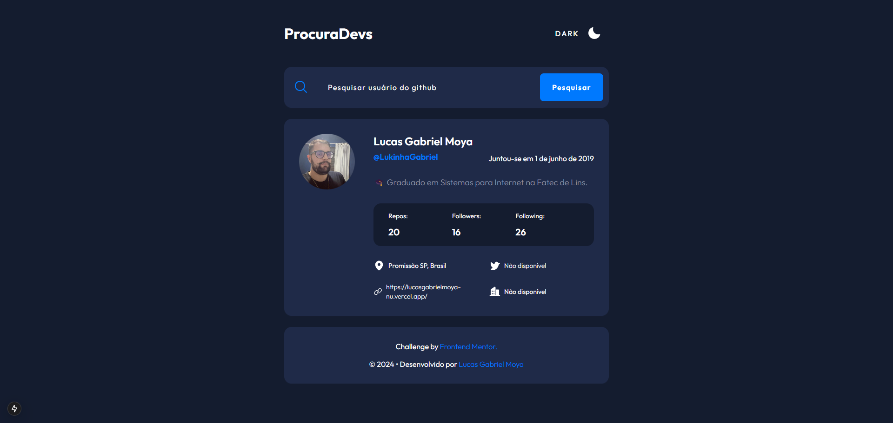
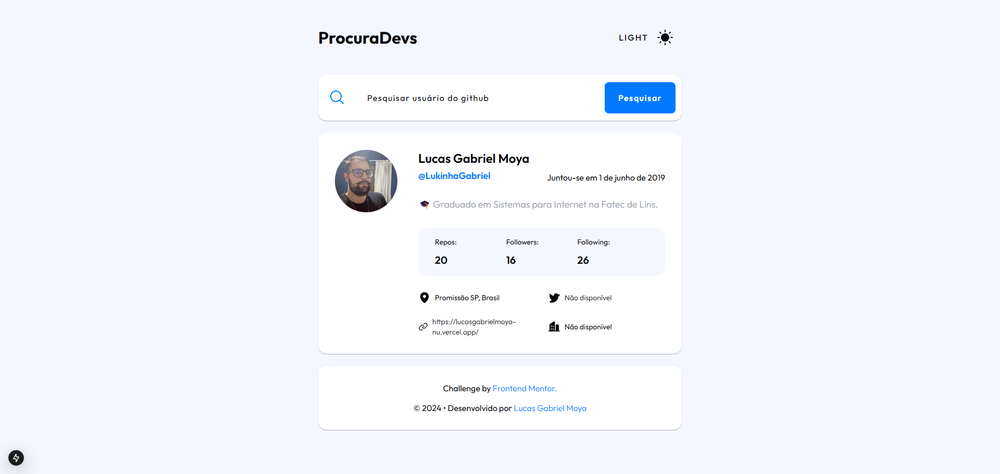

# Site de pesquisa de usuários do GitHub

## Sobre o Projeto
Neste projeto, foi usado a API de usuários do GitHub para extrair dados de perfil e exibi-los. 

### Funcionalidaes

- [x] Pesquisar usuários do GitHub pelo nome de usuário;
- [x] Veja informações relevantes do usuário com base em sua pesquisa;
- [x] Alternar entre temas claros e escuros;
- [x] Veja o layout ideal para o aplicativo dependendo do tamanho da tela do dispositivo;

## Tecnologias Utilizadas
- [x] CSS: Estilização responsiva e personalização visual do layout;
- [x] HTML: Estruturação das páginas e componentes;
- [x] React com NextJS: Framework para criação de páginas dinâmicas e otimização de desempenho;
- [x] JavaScript/TypeScript: Lógica de interação, manipulação de dados e tipagem de componentes;
- [x] API do GitHub: Consumo para buscar perfis de usuários e mostrar informações detalhadas;
- [x] LocalStorage do Navegador: Armazenamento local de dados como preferências de tema;
- [x] [Phosphor](https://phosphoricons.com/) Biblioteca de ícones utilizada para elementos de interface;

## Imagem do Projeto

## Lucas Gabriel Moya

- Website - [https://lucasgabrielmoya-nu.vercel.app/](https://lucasgabrielmoya-nu.vercel.app/)
- Linkedin - [Lucas Gabriel Moya](https://www.linkedin.com/in/lucas-gabriel-moya/)
- Portfólio - [LucasMoya](https://www.notion.so/Lucas-Gabriel-Moya-fc349fed77064d429a8c15664f67f437)